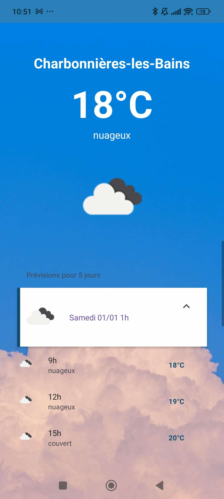

Enoncé :

Application II : Prévisions météo

Objectif : créer une application permettant, à partir de la localisation de votre téléphone, d'accéder à la météo en temps réel ainsi qu'aux prévisions à 5 jours (toutes les trois heures). 

Rendu : tout rendu se fera sous la forme d'un lien vers un repository GitHub. Aucune autre forme de rendu ne sera acceptée.

#Step 1 : 
- Créer un compte sur le site de l'API Openweathermap puis créez une clé API. Rendez-vous en ligne sur l'url suivant pour afficher les end-point disponibles : https://openweathermap.org/price

#Step 2 : 
- Utiliser un module fourni par Expo Go afin d'obtenir la position de votre téléphone (latitude, longitude)

#Step 3 : 
- Afficher la météo du jour : nom de la ville, température en Celsius, description du temps et icône correspondante

#Step 4 : 
- Afficher les prévisions météo sur 5 jours toutes les trois heures grâce aux fonctionnalités de scroll, afin de garder un affichage léger et compréhensible pour vos utilisateur.

#Step 5 : 
- Découpage de votre code en composants
- Styliser votre application
- Ajout d'un loader le temps que les données de l'API soient chargées.

#Visuel :
